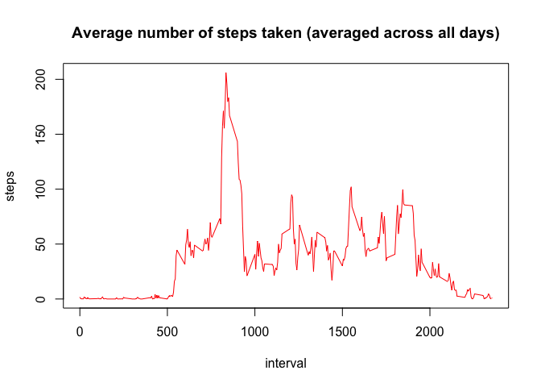
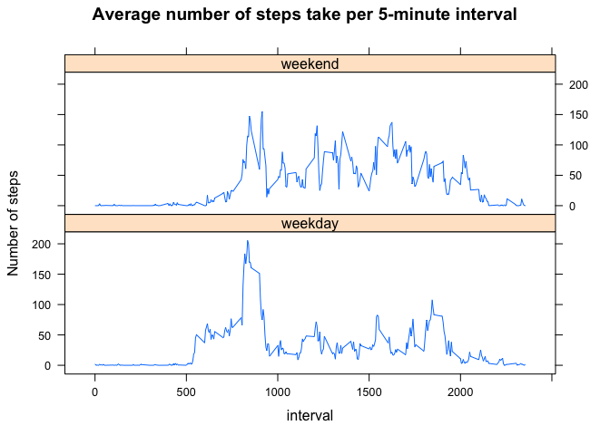

# Reproducible Research: Peer Assessment 1
Mark Anderson  

## Introduction ^[https://github.com/rdpeng/RepData_PeerAssessment1]

It is now possible to collect a large amount of data about personal
movement using activity monitoring devices such as a
[Fitbit](http://www.fitbit.com), [Nike
Fuelband](http://www.nike.com/us/en_us/c/nikeplus-fuelband), or
[Jawbone Up](https://jawbone.com/up). These type of devices are part of
the "quantified self" movement -- a group of enthusiasts who take
measurements about themselves regularly to improve their health, to
find patterns in their behavior, or because they are tech geeks. But
these data remain under-utilized both because the raw data are hard to
obtain and there is a lack of statistical methods and software for
processing and interpreting the data.

This assignment makes use of data from a personal activity monitoring
device. This device collects data at 5 minute intervals through out the
day. The data consists of two months of data from an anonymous
individual collected during the months of October and November, 2012
and include the number of steps taken in 5 minute intervals each day.

## Data ^[https://github.com/rdpeng/RepData_PeerAssessment1]

The data for this assignment can be downloaded from the course web
site:

* Dataset: [Activity monitoring data](https://d396qusza40orc.cloudfront.net/repdata%2Fdata%2Factivity.zip) [52K]

The variables included in this dataset are:

* **steps**: Number of steps taking in a 5-minute interval (missing
    values are coded as `NA`)

* **date**: The date on which the measurement was taken in YYYY-MM-DD
    format

* **interval**: Identifier for the 5-minute interval in which
    measurement was taken


The dataset is stored in a comma-separated-value (CSV) file and there
are a total of 17,568 observations in this
dataset.

## configure knitr
Explicitly tell knitr to write figures to 'figure/'.

```r
library(knitr)
opts_chunk$set(fig.path='figure/')
```

## Loading and preprocessing the data
### Getting the file
Establish source and destination

```r
sourceurl <- "https://d396qusza40orc.cloudfront.net/repdata%2Fdata%2Factivity.zip"
file <- "activity.csv"
```
Fetch the file if it doesn't already exist in working directory

```r
if (!file.exists(file)){
  tmpfile <- tempfile()
  download.file(sourceurl,tmpfile,method="curl")
  unzip(tmpfile,file)
  dateDownloaded <- date()
  dateDownloaded
}
```

```
## [1] "Sat Jan 17 12:42:15 2015"
```
### import the data

```r
data <- read.csv(file)
str(data)
```

```
## 'data.frame':	17568 obs. of  3 variables:
##  $ steps   : int  NA NA NA NA NA NA NA NA NA NA ...
##  $ date    : Factor w/ 61 levels "2012-10-01","2012-10-02",..: 1 1 1 1 1 1 1 1 1 1 ...
##  $ interval: int  0 5 10 15 20 25 30 35 40 45 ...
```
### clean the data
Without casting, data$date is a 'factor'.  Use as.Date to force to 'Date'

```r
data$date <- as.Date(data$date, format="%Y-%m-%d")
str(data)
```

```
## 'data.frame':	17568 obs. of  3 variables:
##  $ steps   : int  NA NA NA NA NA NA NA NA NA NA ...
##  $ date    : Date, format: "2012-10-01" "2012-10-01" ...
##  $ interval: int  0 5 10 15 20 25 30 35 40 45 ...
```
## What is mean total number of steps taken per day?
1. Make a histogram of the total number of steps taken each day

```r
total_steps <- aggregate( steps ~ date, data, sum, na.rm=TRUE)
str(total_steps)
```

```
## 'data.frame':	53 obs. of  2 variables:
##  $ date : Date, format: "2012-10-02" "2012-10-03" ...
##  $ steps: int  126 11352 12116 13294 15420 11015 12811 9900 10304 17382 ...
```

```r
hist(
  total_steps$steps,
  xlab='Steps per day',
  main='Histogram of the total number of steps taken each day')
```

 

2. Calculate and report the **mean** and **median** total number of steps taken per day


```r
mean_steps <- mean(total_steps$steps)
```
The mean number of steps per day is **10766.19**


```r
median_steps <- median(total_steps$step)
```
The median number of steps per day is **10765**


## What is the average daily activity pattern?

1. Make a time series plot (i.e. type = "l") of the 5-minute interval (x-axis) and the average number of steps taken, averaged across all days (y-axis)


```r
stepsPerInterval <- aggregate(steps ~ interval, data, FUN = mean, na.rm = TRUE) 
plot(
  stepsPerInterval, 
  type = "l", 
  col = "red",
  main='Average number of steps taken (averaged across all days)')
```

 

2. Which 5-minute interval, on average across all the days in the dataset, contains the maximum number of steps?


```r
maxStepInterval <- stepsPerInterval[which.max(stepsPerInterval$steps), ]$interval
```
The interval **835** contains the maximum average number of steps
(approximately): 
206 

## Imputing missing values

1. Calculate and report the total number of missing values in the dataset (i.e. the total number of rows with NAs)

```r
length(data$steps[is.na(data$steps)])
```

```
## [1] 2304
```

```r
length(data$interval[is.na(data$interval)])
```

```
## [1] 0
```

```r
length(data$date[is.na(data$date)])
```

```
## [1] 0
```


2. Devise a strategy for filling in all of the missing values in the dataset. The strategy does not need to be sophisticated. For example, you could use the mean/median for that day, or the mean for that 5-minute interval, etc.

First determine the median value of each interval, and define a function to return
that median value on the input of the interval value.

```r
median_of_interval <- aggregate(data$steps ~ data$interval,data,median)
lookup_median <- function(ival) { median_of_interval[which(median_of_interval[,1]==ival),2] }
```
Next, identify all the indexes of rows with NA as the step value.  Then, replace the
NA with the median value for that interval.


3. Create a new dataset that is equal to the original dataset but with the missing data filled in.

Copy the original data into imp_data,
Next, identify all the indexes of rows with NA as the step value in the original data.  
Then, replace theNA with the median value for that interval.

```r
imp_data <- data
idx <- which(is.na(data$steps))
imp_data$steps[idx] <- sapply(idx,function(x) lookup_median(data$interval[x]))
```


4. Make a histogram of the total number of steps taken each day and Calculate and report the mean and median total number of steps taken per day. Do these values differ from the estimates from the first part of the assignment? What is the impact of imputing missing data on the estimates of the total daily number of steps?


```r
imp_total_steps <- aggregate( steps ~ date, data=imp_data, sum)
hist(
  imp_total_steps$steps,
  xlab='Steps per day (Imput values)',
  main='Histogram of Steps per day (after missing values were imputed)')
```

 

The mean number of steps per day

```r
imp_mean_steps <- mean(imp_total_steps$steps)
imp_mean_steps
```

```
## [1] 9503.869
```

```r
imp_mean_steps - mean_steps
```

```
## [1] -1262.32
```
The median number of steps per day

```r
imp_median_steps <- median(imp_total_steps$step)
imp_median_steps
```

```
## [1] 10395
```

```r
imp_median_steps - median_steps
```

```
## [1] -370
```

Most of the NA appear to be in intervals where fewer steps were taken.  So more mass as added to the left side of the histogram.  Both the mean and the median shifted left.

## Are there differences in activity patterns between weekdays and weekends?

1. Create a new factor variable in the dataset with two levels – “weekday” and “weekend” indicating whether a given date is a weekday or weekend day.


```r
imp_data$day_of_week <- as.factor(weekdays(imp_data$date))
imp_data$type_of_day <- 
  ifelse(imp_data$day_of_week %in% c('Saturday','Sunday'),'weekend','weekday')
```

2. Make a panel plot containing a time series plot (i.e. type = "l") of the 5-minute interval (x-axis) and the average number of steps taken, averaged across all weekday days or weekend days (y-axis). See the README file in the GitHub repository to see an example of what this plot should look like using simulated data.

First create two subset of the data, one for weekdays and one for weekends

```r
data_weekday <- subset(
  imp_data,
  imp_data$type_of_day == 'weekday', 
  select=c('steps', 'interval'))
data_weekend <- subset(
  imp_data,
  imp_data$type_of_day == 'weekend', 
  select=c('steps', 'interval'))
```

Next, compute the average step per interval for each subset

```r
dframe_weekday <- data.frame(
  interval = unique(data_weekday$interval),
  average  = tapply(data_weekday$steps,data_weekday$interval,mean)
  )
dframe_weekday$day <- 'weekday'
dframe_weekend <- data.frame(
  interval = unique(data_weekend$interval),
  average  = tapply(data_weekend$steps,data_weekend$interval,mean)
  )
dframe_weekend$day <- 'weekend'
```

Combine back into one data frame for plotting

```r
dframe_combined <- rbind(dframe_weekday,dframe_weekend)
```

Use the lattice library to stack the xyplot atop one another like the example from README.

```r
library(lattice)
xyplot(
  average ~ interval | day, 
  data = dframe_combined,
  layout=c(1,2),
  type='l',
  ylab='Number of steps',
  main='Average number of steps take per 5-minute interval')
```

 

The weekend activity seems more spread out through out the day.  The weekday activity seems more concentrated on certain periods of the day.

